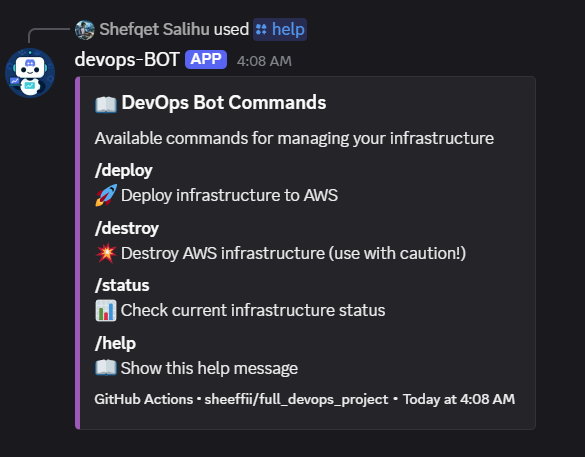

# Full DevOps Project

Complete DevOps CI/CD pipeline with Infrastructure as Code, automated monitoring, alerting, and containerized application deployment on AWS.

## Status Badges

[](https://github.com/sheeffii/full_devops_project/actions/workflows/infra-makefile.yml)
[](https://github.com/sheeffii/full_devops_project/actions/workflows/app-ci.yml)
[](https://github.com/sheeffii/full_devops_project/actions/workflows/bot-ci.yml)
[](https://www.docker.com/)
[](https://www.terraform.io/)
[](https://prometheus.io/)
[](https://grafana.com/)

## 📋 Table of Contents

- [Project Overview](#project-overview)
- [Key Features](#key-features)
- [Performance](#performance)
- [Architecture](#architecture)
- [Screenshots](#-screenshots)
- [Technologies](#technologies)
- [Quick Start](#quick-start)
- [Project Structure](#project-structure)
- [Documentation](#documentation)
- [Contributing](#contributing)

## Project Overview

This project demonstrates a production-ready DevOps workflow with complete automation for infrastructure provisioning, application deployment, and monitoring. It showcases modern DevOps practices including Infrastructure as Code, containerization, CI/CD pipelines, and comprehensive observability.

**What this project includes:**
- **Infrastructure**: Automated AWS infrastructure provisioning using Terraform and Packer
- **Application**: Node.js application with Docker containerization and automated deployment
- **Discord Bot**: Python-based Discord bot for infrastructure management with CI/CD pipeline
- **Monitoring**: Full observability stack with Prometheus, Grafana, and Alertmanager
- **Alerting**: Real-time Discord notifications for infrastructure and application alerts

## ✨ Key Features

### � Automation & CI/CD
- **Fully Automated CI/CD**: GitHub Actions workflows for infrastructure, application, and Discord bot
- **Sequential Pipeline**: Infrastructure → Application → Bot deployment with dependency management
- **Change Detection**: Only rebuilds/redeploys when relevant files change
- **Workflow Dispatch**: Manual trigger support for all pipelines

### 🏗️ Infrastructure & Security
- **Infrastructure as Code**: Terraform for AWS resource management, Packer for custom AMI building
- **Security Best Practices**: IAM roles, encrypted state storage, SSH key management, private S3 buckets
- **State Management**: S3 backend with DynamoDB locking prevents concurrent modifications
- **Zero-Downtime Deploys**: Rolling container updates with health checks

### 📊 Monitoring & Observability
- **Complete Monitoring Stack**: Prometheus, Grafana, Alertmanager with Discord notifications
- **Pre-built Dashboards**: Node Exporter Full dashboard included
- **Alerting Rules**: CPU, memory, disk, and service availability alerts
- **Real-time Alerts**: Color-coded Discord webhook integration for immediate notification

### 🐳 Containerization
- **Containerized Deployment**: Docker containers for all services, automated image building and deployment
- **Private Registry**: AWS ECR for secure Docker image storage
- **Auto-Restart on Boot**: Systemd service ensures applications restart after EC2 reboots
- **Health Checks**: Automated health endpoint monitoring

## ⚡ Performance at a glance

From a push to a live, monitored stack — fully automated:

## 🚀 **Execution Summary**

| **Component**        | ⏱️ **Duration** |
|----------------------|----------------|
| 🧱 **Infrastructure** | ~8m 10s         |
| 🖥️ **Application**    | ~1m 40s         |
| 🤖 **Discord Bot**     | ~1m 39s         |
| 🕒 **Total Time**      | **~10–12 min**  |
| 💥 **Destroy All**     | ~1m 54s         |

---

Timeline
Start → Infra (~ 8m) → App (~ 1m40s) → Bot (~1m39s) → Done

Notes
- Infra includes backend bootstrap, AMI (if needed), EC2/networking, monitoring stack, auto‑redeploy service.
- App/Bot include Docker build, ECR push, and SSM deployment to EC2.

**For the complete runbook and operational details, see [INFRA_OPERATIONS.md](INFRA_OPERATIONS.md).**

## 🏛️ Architecture

### High-Level Architecture Flow
```
┌─────────────────────────────────────────────────────────────┐
│                    GitHub Actions (CI/CD)                    │
│  Infrastructure → Application → Discord Bot → Monitoring     │
└────────────────────────┬────────────────────────────────────┘
                         ↓
                   AWS ECR (Push Images)
                         ↓
              AWS SSM (Remote Deployment)
                         ↓
┌────────────────────────────────────────────────────────────┐
│                    EC2 Instance (Docker Host)               │
│  ┌──────────────┐  ┌─────────────┐  ┌──────────────┐      │
│  │  Node.js App │  │ Discord Bot │  │  Monitoring  │      │
│  │   (Port 80)  │  │             │  │    Stack     │      │
│  └──────────────┘  └─────────────┘  └──────┬───────┘      │
│                                              │              │
│  ┌───────────────────────────────────────────┘              │
│  │                                                          │
│  │  ┌─────────────┐  ┌──────────────┐  ┌────────────┐    │
│  │  │ Prometheus  │  │ Alertmanager │  │  Grafana   │    │
│  │  │  (:9090)    │←→│   (:9093)    │  │  (:3000)   │    │
│  │  └──────┬──────┘  └──────┬───────┘  └────────────┘    │
│  │         │                 │                             │
│  │  ┌──────▼─────────────────▼────┐                       │
│  │  │ Node Exporter | cAdvisor     │                       │
│  │  │   (:9100)    |   (:8080)     │                       │
│  │  └──────────────────────────────┘                       │
│  └──────────────────────┬───────────────────────────────── │
└─────────────────────────┼────────────────────────────────┘
                          │
                   ┌──────▼──────┐
                   │   Discord   │
                   │   Webhook   │
                   └─────────────┘
```

### Monitoring & Alerting Flow
```
Metrics Collection → Alert Evaluation → Notification
       ↓                    ↓                  ↓
  Prometheus         Alertmanager      Discord Proxy
  (scrapes)           (routes)        (formats embeds)
       ↓                                       ↓
  Node Exporter                        Discord Channel
  cAdvisor                            (alerts appear)
       ↓
  Grafana
  (visualizes)
```

**For detailed architecture diagrams and explanations, see [docs/ARCHITECTURE.md](docs/ARCHITECTURE.md)**

## 📸 Screenshots

### Discord Bot Commands
The Discord bot provides interactive commands for infrastructure management:



**Available Commands:**
- `/deploy` - 🚀 Deploy infrastructure to AWS
- `/destroy` - 💥 Destroy AWS infrastructure (use with caution!)
- `/status` - 📊 Check current infrastructure status
- `/help` - 📖 Show this help message

### Monitoring Alerts


**Alert Types:**

**Firing Alert (Warning):**
- 🟠 Orange embed indicates warning-level alert
- Shows current metric value and threshold
- Includes instance, severity, and status information

**Resolved Alert (Success):**
- 🟢 Green embed indicates alert has been resolved
- Automatic notification when conditions return to normal
- Same metadata as firing alert for correlation

**Alert Severity Colors:**
- 🔴 **Critical** - Red (Crimson) - Immediate attention required
- 🟠 **Warning** - Orange - Potential issue detected
- 🔵 **Info** - Blue - Informational messages
- 🟢 **Resolved** - Green - Issue has been fixed

### Monitoring Dashboards

Access Grafana at `http://<EC2_IP>:3000` to view:
- **Node Exporter Full Dashboard** - System metrics (CPU, memory, disk, network)
- **Container Metrics** - Docker container resource usage
- **Custom Dashboards** - Application-specific metrics

## 💻 Technologies

### Cloud & Infrastructure
- **AWS Services**: EC2, ECR, S3, DynamoDB, Systems Manager (SSM)
- **IaC**: Terraform (infrastructure provisioning), Packer (AMI building)
- **Automation**: Makefile, Bash scripting

### CI/CD & Containers
- **CI/CD**: GitHub Actions with workflow orchestration
- **Containers**: Docker for all services and applications
- **Registry**: AWS ECR for private Docker image storage

### Monitoring & Alerting
- **Metrics**: Prometheus (collection & alerting), Node Exporter, cAdvisor
- **Visualization**: Grafana with pre-configured dashboards
- **Alerting**: Alertmanager with Discord webhook integration
- **Custom Proxy**: Python-based Discord notification service

### Applications
- **Node.js App**: Express.js with health check endpoints
- **Discord Bot**: Python with discord.py library
- **Auto-Restart**: Systemd service for container management

## 🚀 Quick Start
- AWS account with appropriate credentials
- GitHub account with repository access
- Docker installed locally (for local development)

### 1. Set Up GitHub Secrets
Configure the following secrets in your GitHub repository (`Settings` → `Secrets and variables` → `Actions`):

**Required:**
- `AWS_ACCESS_KEY_ID` - AWS access key
- `AWS_SECRET_ACCESS_KEY` - AWS secret key
- `DISCORD_WEBHOOK_URL` - Discord webhook for alerts (optional but recommended)

**Optional (for OIDC):**
- `ROLE_TO_ASSUME` - AWS IAM role ARN for GitHub OIDC authentication

### 2. Deploy Infrastructure
```bash
# Infrastructure is automatically deployed on push to main
git push origin main

# Or manually trigger via GitHub Actions UI
# Navigate to Actions → Infrastructure CI/CD → Run workflow
```

### 3. Access Services
After deployment completes (check GitHub Actions logs for URLs):
- **Application**: `http://<EC2_IP>:80`
- **Prometheus**: `http://<EC2_IP>:9090`
- **Alertmanager**: `http://<EC2_IP>:9093`
- **Grafana**: `http://<EC2_IP>:3000` (admin/admin)

### Next Steps
- **Infrastructure Setup**: See [infrastructure/README.md](infrastructure/README.md)
- **Application Development**: See [devop-2-main/README.md](devop-2-main/README.md)
- **Monitoring & Alerting**: See [docs/DISCORD_ALERTING_QUICKSTART.md](docs/DISCORD_ALERTING_QUICKSTART.md)
- **CI/CD Pipeline**: See [docs/ci.md](docs/ci.md)

## 📁 Project Structure

```
full_devops_project/
├── .github/workflows/          # CI/CD pipelines
│   ├── infra-makefile.yml     # Infrastructure deployment
│   ├── app-ci.yml             # Application deployment
│   └── bot-ci.yml             # Discord bot deployment
├── infrastructure/             # Terraform, Packer, AWS infrastructure
│   ├── bootstrap/             # S3 + DynamoDB backend
│   ├── dev/                   # EC2, ECR, security groups, IAM
│   ├── monitoring/            # Monitoring configs and dashboards
│   │   ├── configs/           # Prometheus, Alertmanager, alert rules
│   │   ├── grafana-dashboards/    # Pre-built Grafana dashboards
│   │   └── grafana-provisioning/  # Auto-provisioning configs
│   ├── packer/                # Docker AMI builder
│   └── scripts/               # Deployment and automation scripts
│       ├── deploy_monitoring.sh   # Monitoring stack deployment
│       ├── discord-webhook-proxy.py  # Alert notification service
│       └── redeploy_on_boot.sh    # Auto-restart service
├── devop-2-main/              # Node.js application
│   ├── app/                   # Express.js app with /health endpoint
│   └── Dockerfile             # Multi-stage Docker build
├── discord-bot/               # Discord bot application
│   ├── bot.py                 # Bot logic and commands
│   └── Dockerfile             # Python container
└── docs/                      # Documentation
    ├── ARCHITECTURE.md                # Complete architecture guide
    ├── ALERTING_SETUP.md              # Alerting documentation
    ├── DISCORD_ALERTING_QUICKSTART.md # Quick setup guide
    ├── MONITORING_QUICK_REF.md        # Monitoring reference
    ├── ci.md                          # CI/CD pipeline docs
    └── github-setup.md                # GitHub configuration guide
```

## � Documentation

## 📚 Documentation

### Core Guides
- 📖 [Architecture Overview](docs/ARCHITECTURE.md) - Complete system architecture
- 🚀 [CI/CD Pipeline](docs/ci.md) - GitHub Actions workflow details
- 🔧 [Infrastructure Setup](infrastructure/README.md) - Terraform & Packer guide

### Monitoring & Alerting
- 🔔 [Discord Alerting Quickstart](docs/DISCORD_ALERTING_QUICKSTART.md) - Fast setup guide
- 📊 [Alerting Setup](docs/ALERTING_SETUP.md) - Detailed alerting configuration
- 📈 [Monitoring Quick Reference](docs/MONITORING_QUICK_REF.md) - Metrics and alerts reference

### Additional Resources
- ⚙️ [GitHub Setup Guide](docs/github-setup.md) - Repository configuration
- 🔄 [Monitoring Reorganization](docs/MONITORING_REORGANIZATION.md) - File structure changes
- ✅ [Alerting Implementation](docs/ALERTING_IMPLEMENTATION.md) - Alert system summary

## 🤝 Contributing

1. Fork the repository
2. Create a feature branch (`git checkout -b feature/amazing-feature`)
3. Commit your changes (`git commit -m 'Add amazing feature'`)
4. Push to the branch (`git push origin feature/amazing-feature`)
5. Open a Pull Request

## 📄 License

This project is for educational and demonstration purposes.

## 💬 Support

For issues, questions, or contributions:
- 📝 Open an issue in the GitHub repository
- 📖 Check the [documentation](docs/)
- 🔍 Review [CI/CD workflows](.github/workflows/)

---

**Built with ❤️ using modern DevOps practices**

